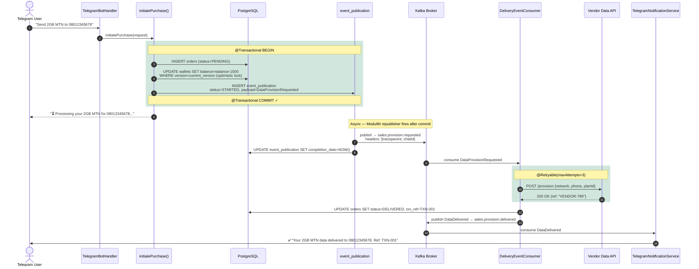
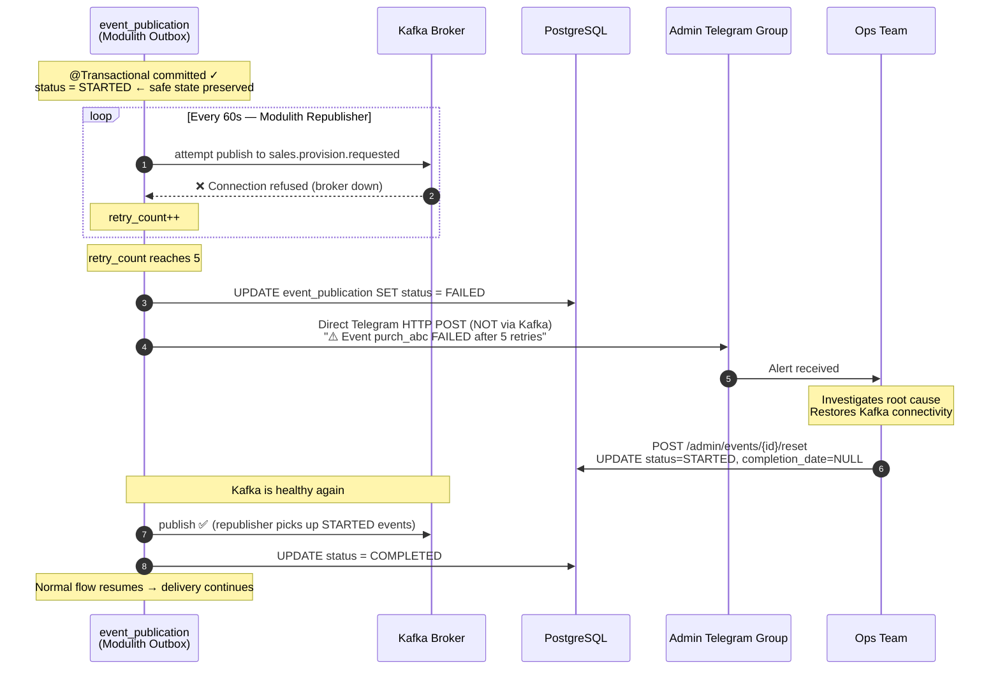
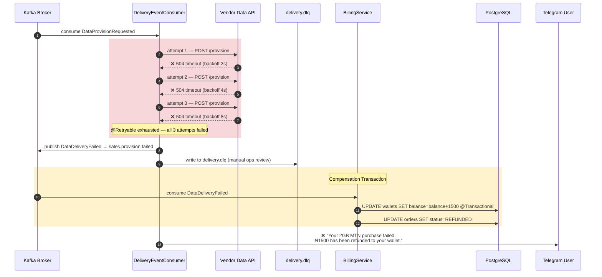
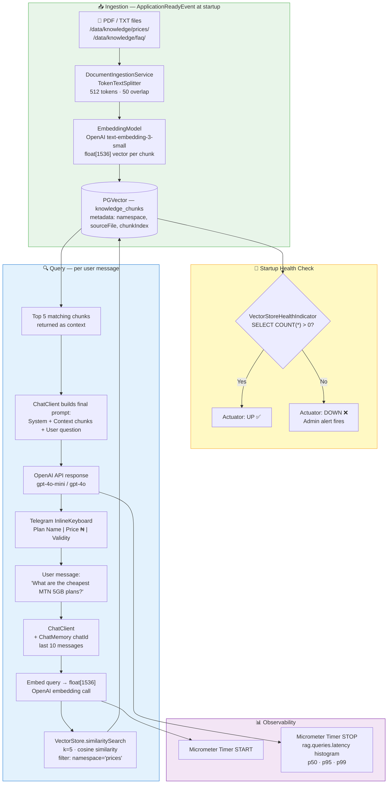
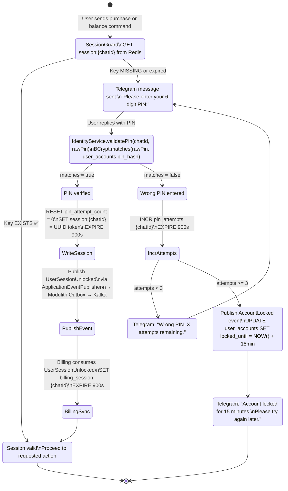
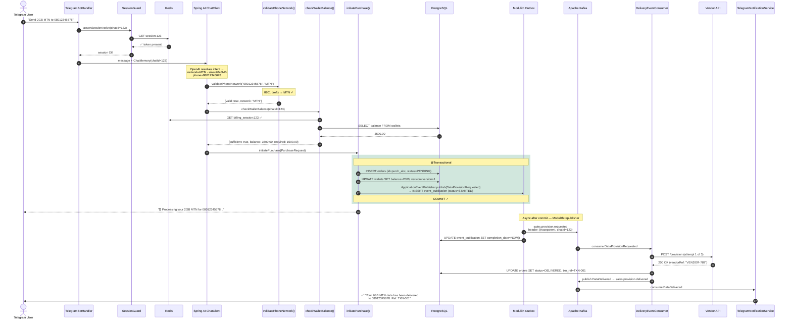
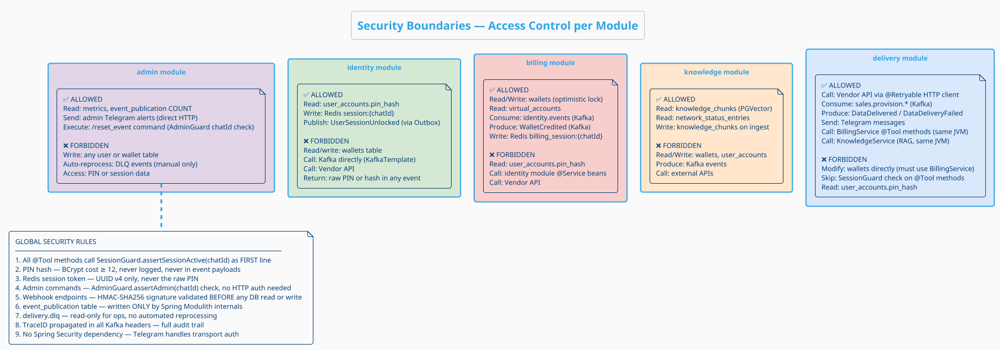
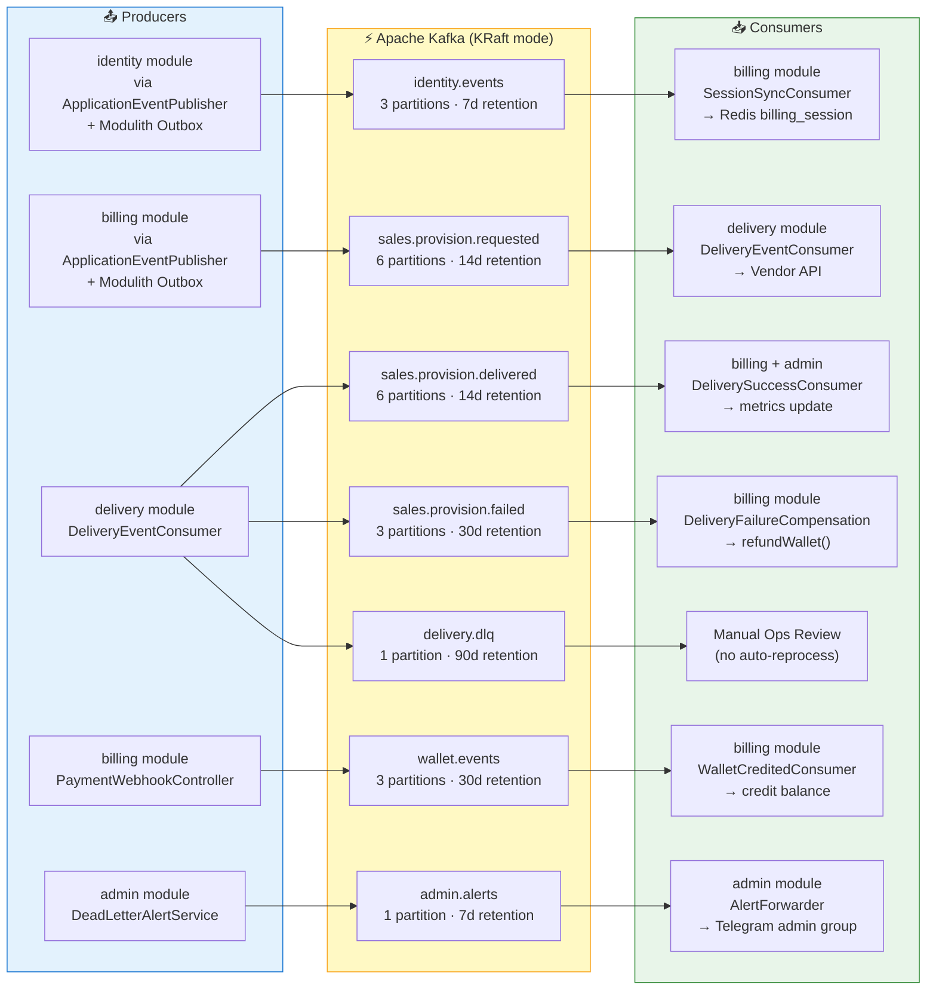

# design.md — System Architecture Design Document
## DataBot NG: Event-Driven Telegram Data Vending Bot

**Version:** 1.0.0
**Date:** 2026

> **Diagram formats used:**
> - **PlantUML** — component diagrams, module boundaries, security boundaries (render at plantuml.com or IntelliJ PlantUML plugin)
> - **Mermaid** — sequence diagrams, flowcharts, state diagrams (render in GitHub, VS Code Mermaid extension, or mermaid.live)

---

## 1. Full System Architecture

```plantuml
@startuml System_Architecture
!theme cerulean-outline
skinparam backgroundColor #FAFAFA
skinparam defaultFontName Arial
skinparam linetype ortho
skinparam nodesep 50
skinparam ranksep 70

title DataBot NG — Full System Architecture

actor "Telegram User" as USER
cloud "Telegram API" as TELEGRAM
cloud "OpenAI API" as OPENAI
cloud "Vendor Data API\n(3rd Party)" as VENDOR
cloud "Bank Webhook\n(Providus / Wema)" as BANK

package "Spring Boot Application" {

  component "TelegramBotHandler" as BOT #LightBlue
  component "SessionGuard\n(Redis check)" as GUARD #LightYellow

  package "identity module" #LightGreen {
    component "IdentityService\n- validatePin()\n- BCrypt check\n- Redis write" as IDENTITY
    component "NigerianPhoneValidator" as VALIDATOR
  }

  package "knowledge module" #LightPink {
    component "KnowledgeService\n- VectorStore search\n- RAG queries" as KNOWLEDGE
    component "NetworkStatusService" as NETSTATUS
  }

  package "billing module" #MistyRose {
    component "BillingService\n- deductWallet()\n- refundWallet()\n- getBalance()" as BILLING
    component "SessionSyncConsumer" as SESSSYNC
    component "PaymentWebhookController" as WEBHOOK
  }

  package "delivery module" #LightSkyBlue {
    component "PurchaseOrchestrationTools\n(@Tool methods)" as TOOLS
    component "ChatClient\n(Spring AI)" as CHATCLIENT
    component "DeliveryEventConsumer\n(@Retryable 3x)" as DELIVERY
    component "TelegramNotificationService" as NOTIFIER
  }

  package "admin module" #Lavender {
    component "SalesMetricsService\n(Micrometer)" as METRICS
    component "DeadLetterAlertService" as DLALERT
    component "VectorStoreHealthIndicator" as HEALTH
  }

  database "Modulith Outbox\nevent_publication" as OUTBOX #Wheat
}

package "Apache Kafka (KRaft)" as KAFKA #LightYellow {
  queue "identity.events" as K_IDENTITY
  queue "sales.provision.requested" as K_PROVISION
  queue "sales.provision.delivered" as K_DELIVERED
  queue "sales.provision.failed" as K_FAILED
  queue "wallet.events" as K_WALLET
  queue "admin.alerts" as K_ALERTS
  queue "delivery.dlq" as K_DLQ
}

package "Persistence Layer" {
  database "PostgreSQL 16 + PGVector\nuser_accounts | wallets | wallet_transactions\nvirtual_accounts | orders\nnetwork_status_entries | knowledge_chunks\nevent_publication" as PG
  database "Redis 7\nsession:{chatId} TTL 15min\nbilling_session:{chatId} TTL 15min\npin_attempts:{chatId} TTL 15min" as REDIS
}

package "Observability Stack" {
  component "Prometheus" as PROM
  component "Grafana Tempo" as TEMPO
  component "Grafana Dashboards" as GRAFANA
  component "OTel Collector" as OTEL
}

' External entry
USER --> TELEGRAM
TELEGRAM --> BOT : long-poll / webhook
BANK --> WEBHOOK : POST /webhook/payment

' Session check
BOT --> GUARD
GUARD --> REDIS : GET session:{chatId}

' AI routing
BOT --> CHATCLIENT
CHATCLIENT --> OPENAI : chat completion
CHATCLIENT --> TOOLS : @Tool dispatch
CHATCLIENT --> KNOWLEDGE : RAG lookup

' Identity
TOOLS --> VALIDATOR
IDENTITY --> REDIS : SET session
IDENTITY --> PG : BCrypt verify
IDENTITY --> OUTBOX : ApplicationEventPublisher

' Billing
TOOLS --> BILLING : checkWalletBalance
WEBHOOK --> K_WALLET

' Outbox → Kafka
OUTBOX --> K_IDENTITY
OUTBOX --> K_PROVISION

' Kafka consumers
K_IDENTITY --> SESSSYNC
SESSSYNC --> REDIS : SET billing_session
K_PROVISION --> DELIVERY
DELIVERY --> VENDOR : @Retryable API call
DELIVERY --> K_DELIVERED
DELIVERY --> K_FAILED
DELIVERY --> K_DLQ
K_FAILED --> BILLING : refundWallet()
K_WALLET --> BILLING : credit wallet
K_DELIVERED --> NOTIFIER
NOTIFIER --> TELEGRAM : sendMessage()

' Admin / Observability
DLALERT --> K_ALERTS
METRICS --> PROM : /actuator/prometheus
PROM --> GRAFANA
OTEL --> TEMPO --> GRAFANA

@enduml
```

---

## 2. Module Boundaries, Aggregate Roots & JPA Rules

```plantuml
@startuml Module_Boundaries
!theme cerulean-outline
skinparam backgroundColor #FAFAFA
skinparam defaultFontName Arial
skinparam packageStyle rectangle
skinparam nodesep 50
skinparam classAttributeIconSize 0

title Spring Modulith + DDD — Module Boundaries & Aggregate Roots

package "identity module" #D5E8D4 {
  class "UserAccount <<AR>>" as UA {
    id : UUID
    chatId : Long
    pinHash : String
    accountStatus : AccountStatus
    --
    validatePin()
    recordFailedAttempt()
    unlock()
  }
  class "UserAccountRepository" as UAR
  class "IdentityService" as IS
  class "SessionGuard" as SG
  class "NigerianPhoneValidator" as NPV
  UAR ..> UA : manages
  IS --> UAR
  IS --> SG
}

package "billing module" #F8CECC {
  class "Wallet <<AR>>" as W {
    id : UUID
    ownerId : UUID
    balance : Money <<VO>>
    version : Long
    --
    debit(amount)
    credit(amount)
    canAfford(amount)
  }
  class "WalletTransaction <<Entity>>" as WT {
    id : UUID
    walletId : UUID
    type : TransactionType
    amount : Money <<VO>>
    reference : String
  }
  class "VirtualAccount <<Entity>>" as VA {
    id : UUID
    walletId : UUID
    accountNumber : String
  }
  class "WalletRepository" as WR
  class "BillingService" as BS
  class "SessionSyncConsumer" as SSC
  W "1" *-- "0..*" WT : @OneToMany cascade=ALL
  W "1" *-- "0..1" VA : @OneToMany cascade=ALL
  WR ..> W : manages
  note bottom of WR : NO repository for\nWalletTransaction\nor VirtualAccount.\nAccess only via Wallet.
  BS --> WR
  SSC --> BS
}

package "sales module" #DAE8FC {
  class "Order <<AR>>" as O {
    id : UUID
    orderRef : String
    buyerChatId : Long
    item : OrderItem <<VO>>
    status : OrderStatus
    --
    markDelivered()
    markFailed()
    requestRefund()
  }
  class "OrderRepository" as OR
  class "PurchaseOrchestrationTools" as POT
  class "DeliveryEventConsumer" as DEC
  OR ..> O : manages
  POT --> OR
  DEC --> OR
}

package "knowledge module" #FFE6CC {
  class "KnowledgeChunk <<AR>>" as KC {
    id : UUID
    content : Text
    namespace : KnowledgeNamespace
    embedding : vector(1536)
  }
  class "NetworkStatusEntry <<AR>>" as NSE {
    id : UUID
    network : Network
    status : NetworkAvailability
    checkedAt : Instant
  }
  class "KnowledgeChunkRepository" as KCR
  class "NetworkStatusEntryRepository" as NSER
  class "KnowledgeService" as KS
  KCR ..> KC : manages
  NSER ..> NSE : manages
  KS --> KCR
  KS --> NSER
}

package "admin module" #E1D5E7 {
  class "SalesMetricsService" as SMS
  class "VectorStoreHealthIndicator" as VSHI
  class "AdminEventResetController" as AERC
}

database "PostgreSQL 16 + PGVector" as PG
database "Redis 7" as REDIS
queue "Apache Kafka" as KAFKA

UAR --> PG : user_accounts
WR --> PG : wallets, wallet_transactions\nvirtual_accounts
OR --> PG : orders
KCR --> PG : knowledge_chunks (vector)
NSER --> PG : network_status_entries
IS --> REDIS : session:{chatId}
SSC --> REDIS : billing_session:{chatId}
SSC --> KAFKA : identity.events (consume)
DEC --> KAFKA : sales.provision.* (consume/produce)
POT --> BS : @Tool (same JVM — allowed)
POT --> KS : RAG @Tool (same JVM — allowed)
SMS --> PG : event_publication COUNT

note as RULES
  JPA RULES
  ─────────────────────────────────────────────────
  1. Only Aggregate Roots have JpaRepository
  2. Value Objects use @Embeddable / @Embedded
  3. Entities within aggregate: @OneToMany(cascade=ALL, orphanRemoval=true)
  4. Cross-context: UUID reference field only — NO @ManyToOne across modules
  5. All ARs: @Version Long version (optimistic locking)
  6. All ARs: UUID PK with @GeneratedValue strategy UUID
  ─────────────────────────────────────────────────
  MODULITH RULES
  ─────────────────────────────────────────────────
  7. Modules communicate via Kafka or ApplicationEventPublisher
  8. @Autowiring across module boundaries: only delivery→billing and delivery→knowledge
  9. All event-publishing methods are @Transactional
end note

@enduml
```

---

## 3. Transactional Outbox Flow

### Happy Path



### Failure Path — Kafka Down



### Failure Path — Vendor API Fails (Refund Flow)



---

## 4. RAG Pipeline Flow



---

## 5. PIN Authentication Flow & Redis Session Lifecycle



---

## 6. Purchase Flow — Complete Event Chain



---

## 7. OpenTelemetry Trace Context Propagation

```mermaid
flowchart LR
    subgraph APP["🏗 Spring Boot App — Trace starts here"]
        direction TB
        S1["Span 1\ntelegram.message.received\n{chatId, messageType}"]
        S2["Span 2\nai.chat.completion\n{model, promptTokens, chatId}"]
        S3["Span 3\ntool.validatePhoneNetwork"]
        S4["Span 4\ntool.checkWalletBalance"]
        S5["Span 5 — @Transactional\ndb.transaction.purchase"]
        S5a["Span 5a\nJDBC: INSERT orders"]
        S5b["Span 5b\nJDBC: UPDATE wallets"]
        S6["Span 6\nmodulith.event.publish\n→ event_publication INSERT"]
        S7["Span 7\nkafka.produce\nsales.provision.requested"]
        S1-->S2-->S3-->S4-->S5
        S5-->S5a & S5b
        S5-->S6-->S7
    end

    subgraph HDR["📨 Kafka Message Header"]
        H["traceparent:\n00-{traceId}-{spanId}-01\n\nSame traceId propagated\nacross thread boundary ↓"]
    end

    subgraph DEL["🚚 Delivery Module — Same trace, new thread"]
        direction TB
        S8["Span 8\nkafka.consume\nDeliveryEventConsumer"]
        S9["Span 9\nhttp.client.request\nVendor API"]
        S10["Span 10\nkafka.produce\nsales.provision.delivered"]
        S11["Span 11\ntelegram.send.message\n{chatId}"]
        S8-->S9-->S10-->S11
    end

    subgraph OBS["👁 Observability — Full trace visible end-to-end"]
        OTEL["OTel Collector\nOTLP receiver :4317"]
        TEMPO["Grafana Tempo"]
        UI["Grafana UI\nTrace: message → confirmation"]
        OTEL-->TEMPO-->UI
    end

    S7 -->|"Kafka message\n+ traceparent header"| HDR
    HDR -->|"OTel context extractor\nresumes same traceId"| S8
    APP -->|"OTLP gRPC"| OTEL
    DEL -->|"OTLP gRPC"| OTEL

    style APP fill:#e3f2fd,stroke:#1976d2
    style DEL fill:#e8f5e9,stroke:#388e3c
    style HDR fill:#fff9c4,stroke:#f9a825
    style OBS fill:#f3e5f5,stroke:#7b1fa2
```



---

## 8. Security Boundaries



---

## 9. Kafka Topic Map

