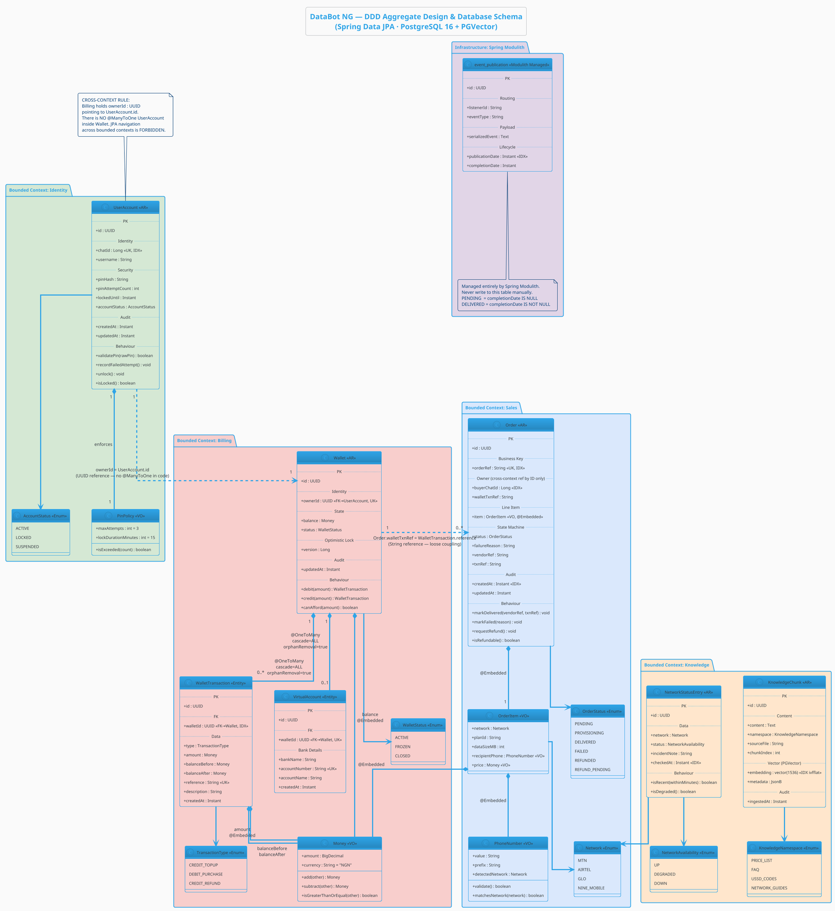

# schema.md — DDD Aggregate Design & Database Schema

## DataBot NG · Spring Data JPA · PostgreSQL 16 + PGVector

---

## Legend

| Symbol       | Meaning                                                                   |
| ------------ | ------------------------------------------------------------------------- |
| `<<AR>>`     | Aggregate Root — has its own`JpaRepository`, is the consistency boundary |
| `<<Entity>>` | Entity within an aggregate — no repository, accessed only via its root   |
| `<<VO>>`     | Value Object —`@Embeddable`, no `@Id`, identified by its values          |
| `<<Enum>>`   | Java enum mapped as`@Enumerated(EnumType.STRING)`                         |
| `PK`         | Primary Key                                                               |
| `FK`         | Foreign Key                                                               |
| `UK`         | Unique Key constraint                                                     |
| `IDX`        | Indexed column                                                            |

---

## Full Domain Model

---

## JPA Mapping Cheat Sheet

### Aggregate Roots → Tables

| Aggregate Root       | Table                    | Module                               |
| -------------------- | ------------------------ | ------------------------------------ |
| `UserAccount`        | `user_accounts`          | identity                             |
| `Wallet`             | `wallets`                | billing                              |
| `WalletTransaction`  | `wallet_transactions`    | billing (no repo — owned by Wallet) |
| `VirtualAccount`     | `virtual_accounts`       | billing (no repo — owned by Wallet) |
| `Order`              | `orders`                 | sales                                |
| `NetworkStatusEntry` | `network_status_entries` | knowledge                            |
| `KnowledgeChunk`     | `knowledge_chunks`       | knowledge                            |

### Value Objects → Embedded Columns

| Value Object      | Embedded Into              | Columns Generated                                                                  |
| ----------------- | -------------------------- | ---------------------------------------------------------------------------------- |
| `PinPolicy`       | `user_accounts`            | `max_attempts`, `lock_duration_minutes`                                            |
| `Money` (balance) | `wallets`                  | `balance_amount`, `balance_currency`                                               |
| `Money` (amount)  | `wallet_transactions`      | `amount_value`, `amount_currency`, `balance_before_amount`, `balance_after_amount` |
| `OrderItem`       | `orders`                   | `network`, `plan_id`, `data_size_mb`, `price_amount`, `price_currency`             |
| `PhoneNumber`     | `orders` (via `OrderItem`) | `recipient_phone`, `recipient_prefix`, `recipient_detected_network`                |

### Repository Map

| Repository                     | Aggregate Root       | Allowed Callers                                       |
| ------------------------------ | -------------------- | ----------------------------------------------------- |
| `UserAccountRepository`        | `UserAccount`        | `IdentityService` only                                |
| `WalletRepository`             | `Wallet`             | `BillingService` only                                 |
| `OrderRepository`              | `Order`              | `PurchaseOrchestrationTools`, `DeliveryEventConsumer` |
| `NetworkStatusEntryRepository` | `NetworkStatusEntry` | `NetworkStatusService` only                           |
| `KnowledgeChunkRepository`     | `KnowledgeChunk`     | `DocumentIngestionService`, `KnowledgeService`        |

> `WalletTransaction` and `VirtualAccount` have **no repository**. They are accessed only by loading the parent `Wallet` aggregate. `OrderItem` and `PhoneNumber` have **no repository** — they are value objects embedded directly into the `orders` table.

---

## DDD Rules Enforced by This Design

1. **Aggregate boundary = transaction boundary.** One `@Transactional` method touches one aggregate root.
2. **No cross-aggregate direct object references.** `Order` holds `buyerChatId : Long`, not `UserAccount user`.
3. **Value objects are immutable.** `Money`, `PhoneNumber`, `OrderItem` have no setters — they are replaced, never mutated.
4. **Behaviour lives on the aggregate, not in the service.** `wallet.debit(amount)` not `billingService.deductFromWallet(id, amount)`.
5. **Enums are stored as strings.** All enums use `@Enumerated(EnumType.STRING)` — never ordinal.
6. **Optimistic locking on all mutable roots.** `@Version Long version` on `Wallet` and `Order`.
7. **UUIDs as PKs.** Generated by PostgreSQL `gen_random_uuid()`, mapped with `@GeneratedValue(strategy = GenerationType.UUID)`.
